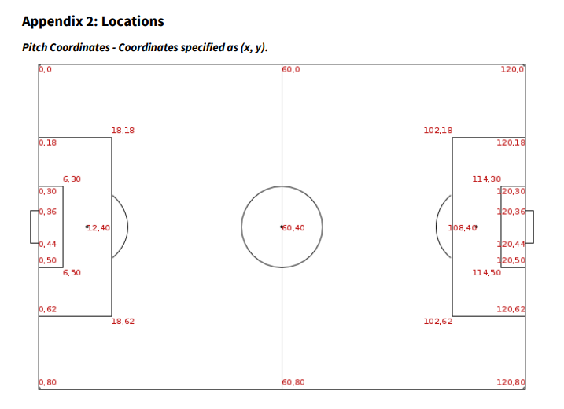

# PODS Project

## Topic

- Football Possession

## Team

- Lena Ebner
- Wojciech Woszczek
- Tim Schwabe

## Content

- [Pre: Open Stats Data Preprocessing (not used later)](./preprocessing_of_open-data.py)
- [WorldCupDataset Analysis with some Visualizations](./wordcup_data_analysis.ipynb)
- [WorldCupDataset Additional Preprocessing](./wordcup_data_preprocessing.ipynb)
  - contains adding `startZone`, `endZone`
  - filling `duration` None values with 0 and adjusting `endTime`

## Pitch Definition

## Resources

- Docu: https://github.com/statsbomb/open-data/blob/master/doc/Open%20Data%20Events%20v4.0.0.pdf
- Open-Data Repo: https://github.com/statsbomb/open-data/tree/master
- Fluxicon Process Mining Meets Football: https://fluxicon.com/blog/2019/10/process-mining-meets-football-how-does-a-football-team-possess-the-ball-on-the-pitch/
- [Open-Stats Data Docu](StatsBomb%20Open%20Data%20Specification%20v1.1.pdf)
